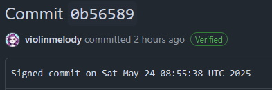
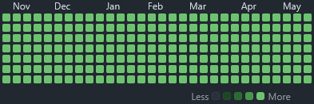

[](https://docs.github.com/en/actions/writing-workflows/about-workflows#about-workflows) [](https://en.wikipedia.org/wiki/MIT_License) [](https://ko-fi.com/violinmelody)


# [POC] Updating Github Contribution Activity Calendar with Automated Github Actions

This repository is a **Proof of Concept** of self-hosted automated daily signed commits to GitHub using a GPG key. Commits pushed like this are seen by Github as verified and pollute Github Activity history therefore show in Calendar. Only GitHub Actions are used so there is no need to run anything locally.




## ⚠️ WARNING: Responsible Use Only ⚠️

This project is provided **solely as a Proof of Concept (POC)** for educational purposes. It is not intended for production use or abuse. **Do not use it to manipulate GitHub contribution metrics**, misrepresent activity, or deceive others. 

**Misuse of this tool to "game" the system or inflate activity artificially** may violate GitHub's Terms of Service and acceptable use policies. Always use this project responsibly and only on repositories you own or have explicit permission to automate.

By using this tool, you agree to follow [GitHub's Terms of Service](https://docs.github.com/en/site-policy/github-terms/github-terms-of-service) and their [Acceptable Use Policies](https://docs.github.com/en/site-policy/acceptable-use-policies/github-acceptable-use-policies).

## 📝 Prerequisites

1. **GPG Key**: Generate or import a GPG key (both private and public).
2. **GitHub PAT**: Create a Personal Access Token (PAT) named `GIT_PONY_PAT` with `repo` and `workflow` scopes in https://github.com/settings/personal-access-tokens

## 🛠️ Setup

### 1. Fork this repository

### 2. Add Secrets to this repository

Go to **Settings > Secrets > Actions** and add the following secrets:

- `GPG_PRIVATE_KEY`: The private GPG key added to your Github account.
- `GPG_PASSPHRASE`: The passphrase for your GPG key (if any).
- `GIT_USER_NAME`: Your GitHub username (e.g. `username`).
- `GIT_USER_EMAIL`: Your GitHub email (e.g. `01234567+username@users.noreply.github.com`).

### 3. Add Your Public GPG Key to GitHub

Go to **Settings > SSH and GPG keys > New GPG key** and paste your **public GPG key** there. This is used by GitHub to verify your signed commits.

### 4. Configure GitHub Actions Workflow

Find this workflow file `.github/workflows/commit.yml` in this repository, it will contain all the necessary steps to import your GPG key, configure Git and make signed commits.

By default this workflow is set to be run manually but if you want to make it run automatically find this:
```
on:
  #schedule:
    #- cron: '0 0 * * *'  # Runs daily at midnight UTC
  workflow_dispatch:
```
and uncomment it so it looks like this:
```
on:
  schedule:
    - cron: '0 0 * * *'  # Runs daily at midnight UTC
  workflow_dispatch:
```

### 4. Triggering the Workflow

The workflow will run automatically* every day at midnight UTC or you can trigger it manually from the **Actions** tab in GitHub.

*- if you edited the workflow file & uncommented scheduled cron job

## ⚙️ Troubleshooting

- Ensure your GPG keys (private and public) are correctly added to GitHub Secrets and your GitHub account.
- Verify the PAT has the necessary permissions.
- Make sure your GitHub username and email are correctly stored as secrets (`GIT_USER_NAME` and `GIT_USER_EMAIL`).

## 🗒️ Disclaimer

This is **just a Proof of Concept (POC)**. The intent is to **demonstrate what is technically possible** and to learn how automation works with GitHub Actions, not to deceive or manipulate activity graphs. 

The author takes **no responsibility** for any misuse of this code and **makes no guarantees** about compliance in specific use cases. Ensure your use of automation aligns with GitHub's guidelines and best practices to avoid violations.
